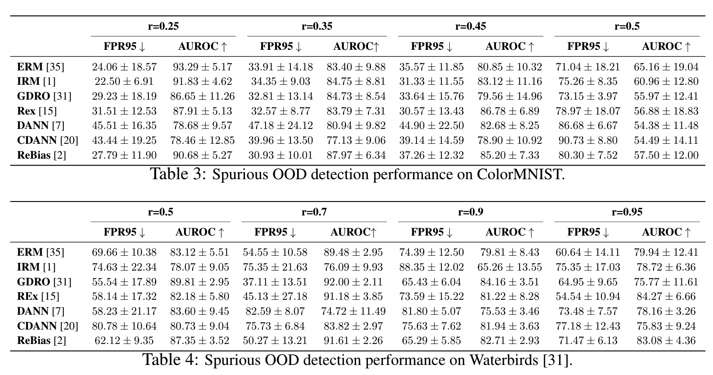

# Rethinking Out-of-distribution Detection: A Perspective from Domain Invariance
This codebase provides a Pytorch implementation for the paper: Rethinking Out-of-distribution Detection: A Perspective from Domain Invariance. Some parts of the codebase are adapted from [ODIN](https://github.com/facebookresearch/odin), [Deep Mahalanobis Detector](https://github.com/pokaxpoka/deep_Mahalanobis_detector) , [NTOM](https://github.com/jfc43/informative-outlier-mining), [DomainBed](https://github.com/facebookresearch/DomainBed), [Rebias](https://github.com/clovaai/rebias) and [GDRO](https://github.com/kohpangwei/group_DRO).

## Abstract
Modern neural networks can assign high confidence to inputs drawn from outside the training distribution, posing threats to models in real-world deployments. While much research attention has been placed on designing new out-of-distribution (OOD) detection methods, the precise definition of OOD is often left in vagueness and falls short of the desired notion of OOD in reality. In this paper, we present a new formalization through the lens of domain invariance, and model the data shifts by taking into account both the invariant and non-invariant (spurious) features. Of a particular challenge, we show that competitive OOD detection methods can fail to detect an important type of OOD samples---spurious OOD---which contains no invariant feature yet with similar non-invariant features as the in-distribution data. Further, we show that such failure cases cannot be easily mitigated, even when the models are trained with recent popular domain invariance learning objectives. We provide theoretical insights on why reliance on non-invariant features leads to high OOD detection error. Our work aims to facilitate the understanding of OOD samples and their evaluations, as well as the exploration of invariant prediction methods that enhance OOD detection. 

## Main Results


## Required Packages
Our experiments are conducted on Ubuntu Linux 20.04 with Python 3.8 and Pytorch 1.6. Besides, the following packages are required to be installed:
* Scipy
* Numpy
* Sklearn
* Pandas
* Matplotlib
* Seaborn

## In-distribution Datasets

- In-distribution training sets:
  - [CelebA](http://mmlab.ie.cuhk.edu.hk/projects/CelebA.html): Large-scale CelebFaces Attributes Dataset. 
  - ColorMINST:  A colour-biased version of the original [MNIST](http://yann.lecun.com/exdb/mnist/) Dataset. 
  - WaterBirds:  Similar to the construction in [Group_DRO](https://github.com/kohpangwei/group_DRO), this dataset is constructed by cropping out birds from photos in the Caltech-UCSD Birds-200-2011 (CUB) dataset (Wah et al., 2011) and transferring them onto backgrounds from the Places dataset (Zhou et al., 2017).

## Out-of-distribution Test Datasets

###  Non-spurious OOD Test Sets

We provide links and instructions to download each dataset:

* [Textures](https://www.robots.ox.ac.uk/~vgg/data/dtd/download/dtd-r1.0.1.tar.gz): download it and place it in the folder of `datasets/ood_datasets/dtd`.
* [LSUN-R](https://www.dropbox.com/s/moqh2wh8696c3yl/LSUN_resize.tar.gz): download it and place it in the folder of `datasets/ood_datasets/LSUN_resize`.
* [iSUN](https://www.dropbox.com/s/ssz7qxfqae0cca5/iSUN.tar.gz): download it and place it in the folder of `datasets/ood_datasets/iSUN`.

For example, run the following commands in the **root** directory to download **LSUN-R**:
```
cd datasets/ood_datasets
wget https://www.dropbox.com/s/moqh2wh8696c3yl/LSUN_resize.tar.gz
tar -xvzf LSUN.tar.gz
```

### Spurious OOD Test Sets


## Code overview

`datasets/colour_mnist.py` downloads the original MNIST and applies colour biases on images by itself. No extra preparation is needed on the user side.

### Running Experiments
* `select_svhn_data.py`: select SVHN test data.
* `eval_ood_detection.py`: evaluate OOD detection performance of various methods (MSP, ODIN, Mahalanobis, NTOM, CCU, SOFL,  BOM (K+1 scheme) )
* `compute_metrics.py`: compute metrics of based on results generated by `eval_ood_detection.py`.
* `train_ntom.py`: train NTOM model.
* `train_ccu.py`: train CCU model.
* `train_oe.py`: train OE model.
* `train_sofl.py`: train SOFL model.
* `train.py`: train vanilla model.
* `train_blr.py`: train BOM model.
* `train_energy.py`: train Energy-regularised model.
* `get_score.py`: evaulate OOD detection performance of Energy-based methods (Energy and BOM).
* `get_results.py`: compute metrics of based on results generated by `get_score.py`.
* `tune_mahalanobis_hyperparams.py`: tune hyperparameters of Mahalanobis detector.
* `tune_odin_hyperparams.py`: tune hyperparameters of ODIN detector.

### Examples
Here we provide a sample of commands for training (CIFAR-10 as an example):

```python
# train an vanilla model (for MSP, Mahalanobis, Energy, and ODIN)
python train.py --name vanilla --in-dataset CIFAR-10 --auxiliary-dataset imagenet --epochs 100 

# train an SOFL model
python train_sofl.py --name SOFL --in-dataset CIFAR-10 --auxiliary-dataset imagenet --epochs 100 --ss-epochs 100 

# train an OE model
python train_oe.py --name OE --in-dataset CIFAR-10 --auxiliary-dataset imagenet --epochs 100 

# train an CCU model
python train_ccu.py --name CCU --in-dataset CIFAR-10 --auxiliary-dataset imagenet --epochs 100 

# train an NTOM model
python train_ntom.py --name NTOM --in-dataset CIFAR-10 --auxiliary-dataset imagenet --epochs 100  --quantile 0.125

# train an Energy-regularized model
python train_energy.py --name Energy-OE --in-dataset CIFAR-10 --auxiliary-dataset imagenet --epochs 100 

# train an BOM model
python train_bom.py --name BOM --in-dataset CIFAR-10 --auxiliary-dataset imagenet --epochs 100 
```


In general, to evaluate an OOD detection method, you can use the following command: 

`python eval_ood_detection.py --in-dataset {in-distribution dataset} --name {experiment name} --method {scoring function} --epochs {evalutaion epoch}`

`{in-distribution dataset}` can be`CIFAR-10` or `CIFAR-100`. 

`{scoring function}` can be `msp`, `odin`, `mahalanobis`, `sofl`, or `atom`. 

`{experiment name}` is the name of the model that you have trained. The model type should match the corresponding scoring function. See the following table for the matchings: 

`{epochs}` is the checkpoint epoch (or epochs) at which you want to test the OOD detection. The default value is 100. (if multiple tests at different epochs are desired, you can use e.g. "60 70 80 90 100")

| Method | Scoring Function Name |
| ------------- | ------------- |
| vanilla  |  msp |
| vanilla  | odin  |
| vanilla  | mahalanobis  |
| SOFL     |  sofl |
| OE       |  msp  |
| NTOM  | ATOM |
| CCU      |  msp |
| BOM (K+1 scheme) | ATOM |

Here we provide a sample of commands for evaluating the OOD performance of various methods:

```python
# Generate evaluation results for MSP
python eval_ood_detection.py --name vanilla --method msp

# Generate evaluation results for ODIN:
python eval_ood_detection.py --name vanilla --method odin

# Generate evaluation results for Mahalanobis:
python tune_mahalanobis_hyperparams.py --name vanilla
python eval_ood_detection.py --name vanilla --method mahalanobis

# Generate evaluation results for Energy:
python get_score.py --name Energy 

# Generate evaluation results for BOM:
python get_score.py --name BOM 

# Generate evaluation results for SOFL:
python eval_ood_detection.py --name SOFL --method sofl

# Generate evaluation results for OE:
python eval_ood_detection.py --name OE --method msp

# Generate evaluation results for CCU:
python eval_ood_detection.py --name CCU --method msp

# Generate evaluation results for NTOM:
python eval_ood_detection.py --name NTOM --method atom

# Present OOD detection metrics based on results:
python compute_metrics.py --name vanilla --method msp
python compute_metrics.py --name vanilla --method odin
python compute_metrics.py --name vanilla --method mahalanobis
python compute_metrics.py --name SOFL --method sofl
python compute_metrics.py --name OE --method msp
python compute_metrics.py --name CCU --method msp
python compute_metrics.py --name NTOM --method atom
python get_results.py --name Energy 
python get_results.py --name BOM 
```


Note that we will merge the evaluation script for enegy-regulazied training and testing (i.e. Energy and BOM) with the script for evaluating other methods.
